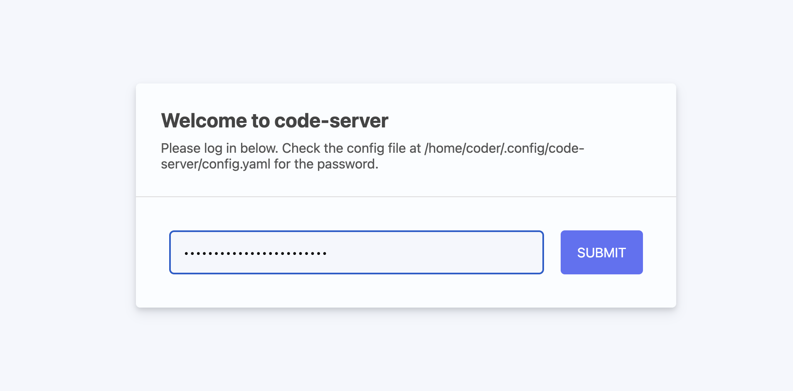
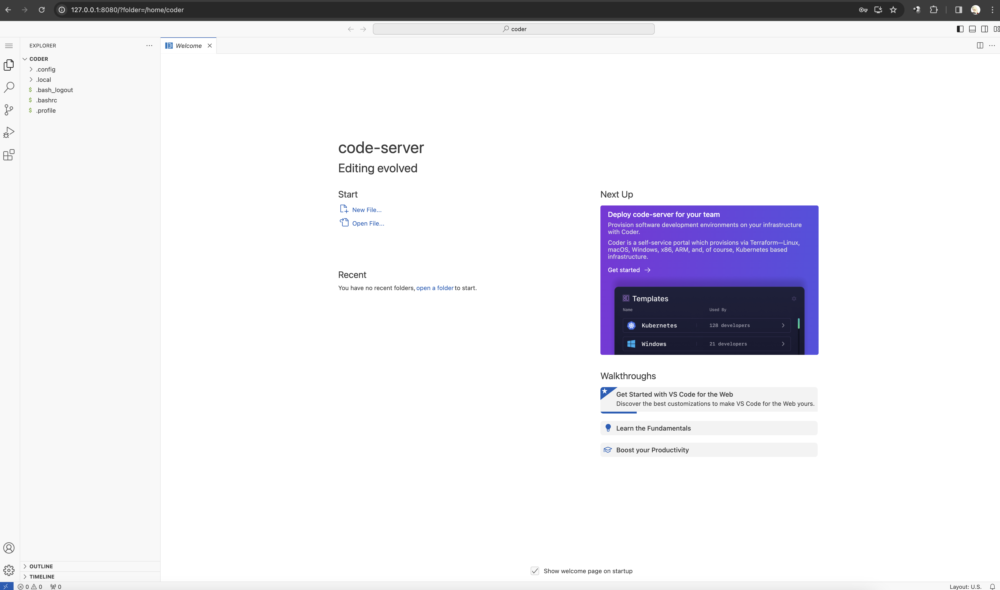

# JavaDevPlayground

## 説明

Java学習環境

セキュリティについては完全にザル、学習用にのみ使うこと。

参考資料 （読まなくてもいいように書いてある）

Docker公式
https://www.docker.com/

Docker入手先
https://matsuand.github.io/docs.docker.jp.onthefly/get-docker/

【入門】Dockerとは？概要やメリット、インストール方法をわかりやすく解説公開
https://www.kagoya.jp/howto/cloud/container/docker/

## コンテナについて

### vscode

ブラウザから開発用のエディタを使用することができるようにするサービス

### postgresql

postgresqlのサービス

### mariadb

mariadbのサービス

## 使い方

### コンテナの起動・停止

**起動**

% docker-compose up -d
>Creating network "javadevplayground_default" with the default driver
>Creating javadevplayground_postgresql_1 ... done
>Creating javadevplayground_vscode_1     ... done
>Creating javadevplayground_mariadb_1    ... done

**停止**

% docker-compose down
>Stopping javadevplayground_vscode_1     ... done
>Stopping javadevplayground_postgresql_1 ... done
>Stopping javadevplayground_mariadb_1    ... done

**プロセスの確認**

% docker ps
>CONTAINER ID   IMAGE                                COMMAND                  CREATED          STATUS         >PORTS                    NAMES
>23bb616fa56e   postgres:latest                      "docker-entrypoint.s…"   30 seconds ago   Up 8 seconds   0.0.0.0:5432->5432/>tcp   javadevplayground_postgresql_1
>2ea1231cdfbc   mariadb:latest                       "docker-entrypoint.s…"   30 seconds ago   Up 8 seconds   0.0.0.0:3306->3306/>tcp   javadevplayground_mariadb_1
>e3b9c61e0b60   codercom/code-server:latest          "/usr/bin/entrypoint…"   30 seconds ago   Up 8 seconds   0.0.0.0:8080->8080/>tcp   javadevplayground_vscode_1

**コンテナを再ビルドするとき**

docker-compose up -d --build

これを実行すると、docker-compose.yml内の設定を見てコンテナを作り直す

### VSCODE環境への入り方

まず、コンテナのShellに入る(これを実行するとDocker内のvscode環境に入れる)
$ docker-compose exec vscode bash  

UTCからJSTに変更（これで日付時刻が日本時間になる）
$ sudo ln -sf /usr/share/zoneinfo/Asia/Tokyo /etc/localtime

ブラウザを開いて以下のURLにアクセス
127.0.0.1:8080

この画面が出ることを確認する

VSCODEの設定は置いておいて、javaのインストール作業に入る

$ sudo apt update
$ apt install -y
$ sudo apt install curl tree wget default-jre default-jdk postgresql-client mariadb-client git tig

確認

$ java -version
openjdk version "11.0.21" 2023-10-17
OpenJDK Runtime Environment (build 11.0.21+9-post-Debian-1deb11u1)
OpenJDK 64-Bit Server VM (build 11.0.21+9-post-Debian-1deb11u1, mixed mode)

$ javac -version
javac 11.0.21

### VSCODE環境の設定

ブラウザを開いて以下のURLにアクセス
127.0.0.1:8080

この画面からパスワードを入力する

パスワードはコンテナ内で以下のファイルの内容を入力する

以下のコマンドを実行してpasswordを確認する(XXXXXの内容をコピー)
$ cat .config/code-server/config.yaml
bind-addr: 127.0.0.1:8080
auth: password
password: XXXXX
cert: false

この画面に遷移すること

日本語化について

https://www.javadrive.jp/vscode/install/index4.html

Java拡張機能の入れ方

https://teramaguro.hatenablog.com/entry/2021/12/28/042743

### DB接続について

POSTGRES_USER: root
POSTGRES_PASSWORD: root

クライアントが入っていれば以下のコマンドで入れる

$ psql -h postgresql  -d sample -U root
>Password for user root: パスワードを入力
